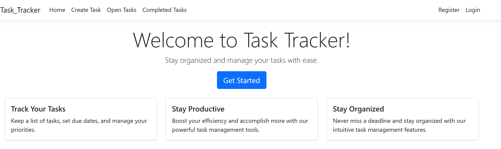

# Task Tracker App

## Introduction

Welcome to the Task Tracker App! This project showcases a simple yet effective task management application built using ASP.NET Razor Pages. The app allows users to manage their tasks by creating, updating, and marking tasks as completed. With a user-friendly interface and seamless interactions, this app is an excellent demonstration of practical web development skills.

## Features

- **User Authentication**: Users can sign in to access their personalized task list and ensure the security of their data.
- **Create Tasks**: Users can easily create new tasks with names, descriptions, due dates, and status selections.
- **Update Tasks**: Existing tasks can be updated, providing the flexibility to modify task details as needed.
- **Mark as Completed**: Tasks can be marked as completed, helping users keep track of their progress.
- **Task Lists**: Separate views for open tasks and completed tasks provide organized task management.
- **Responsive Design**: The app is responsive, ensuring a seamless experience across different devices.

## Installation

1. Clone this repository to your local machine using `git clone`.
2. Make sure you have [ASP.NET Core](https://dotnet.microsoft.com/download) installed.
3. Navigate to the project directory and run `dotnet restore` to install project dependencies.

## Usage

1. Run the app using `dotnet run` and access it through your web browser at `http://localhost:5000`.
2. Register a new account or log in if you already have an account.
3. Create new tasks, update existing ones, and mark them as completed.
4. Navigate between different task lists to manage your tasks efficiently.

## Technologies

- **ASP.NET Core Razor Pages**: Provides a framework for building web pages using C# and Razor syntax.
- **Entity Framework Core**: Used for database management and interaction.
- **Bootstrap**: Ensures responsive and visually appealing UI design.
- **C#**: The primary programming language for building the application's logic.
- **HTML/CSS**: Utilized for creating web page structure and styling.

## License

This project is licensed under the [MIT License](LICENSE).

## Key Takeaways

- **Entity Framework Core**: Learn how to interact with databases, perform CRUD operations, and manage data relationships using Entity Framework Core.
- **User Authentication**: Gain hands-on experience in implementing user authentication and authorization features to secure user data and ensure a personalized experience.
- **Dependency Injection**: Understand the importance of dependency injection and how it promotes decoupling and maintainability of your application.
- **Validation and Form Handling**: Learn how to validate user input, handle form submissions, and provide meaningful feedback to users.
- **Responsive Design**: Explore the concepts of responsive web design and ensure that your application functions seamlessly across various devices and screen sizes.
- **Version Control (Git)**: Practice using version control with Git and GitHub to collaborate on projects, manage changes, and track your progress.
- **Documentation**: Gain skills in writing clear and informative documentation, helping users understand how to install, use, and contribute to your project.
- **Project Management**: Acquire insights into project organization, structuring codebase, and maintaining a clean and scalable architecture.
- **Problem Solving**: Enhance your problem-solving skills by addressing challenges that arise during development and finding effective solutions.
